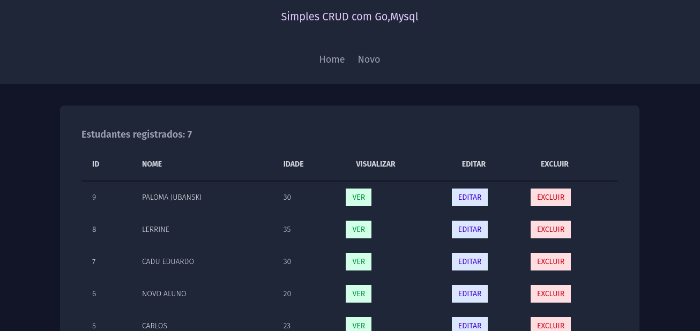

# Simples crud com go e mysql

Foi desenvolvido um crud simples para pratica de conhecimentos, usando a linguagem Go e o banco de dados Mysql.

## Tecnologias

- Go
- Mysql
- Html
- Tailwindcss
- Air (Para live reload)

## Pré requisitos para rodar e testar o projeto

- Go (versão 1.20): [link para download](https://golang.org/dl/)
- Mysql [link para download](https://www.mysql.com/downloads/)
- Air [link para instalação](https://github.com/cosmtrek/air)

## Configuração

1. Clone o repositorio: https://github.com/DanielVavgenczak/gomysqlsimplecrud.git
2. Acesso o diretorio cd gomysqlsimplecrud
3. crie um arquivo .env na raiz do projeto
4. copie e coloque a estrutura do .env_example para o .env que acabou de criar
5. No .env que foi criado coloque as suas informações de acesso do mysql
6. Execute go get ./...

## Funcionalidades

[x] Cria um estudande
[x] Ler a informações do estudante cadastrado
[x] Atualiza as de um registro de estudante
[x] Deleta um estudante

O campos para criar, atualizar estão sendo validados
